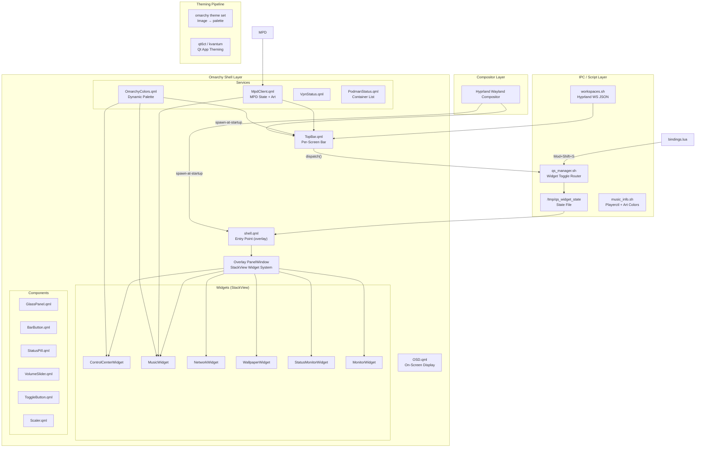

# NightForge Architecture

Active subsystems:

1. **TETHER Harness Control Plan** — Go monitoring daemon on `127.0.0.1:9191`
2. **Observability Stack** — Docker Compose (OTel/Prometheus/Grafana/Langfuse)
3. **CUE Config Migration** — CUE schemas + Go toolchain for Hyprland config
4. **Desktop Shell** — Hyprland compositor + Omarchy shell + Omarchy theming

The Go module is `github.com/CR1MS0N-Operator/nightforge` (`go 1.26.5`), with
`go-chi/chi/v5` as the only external dependency (dashboard API router).

---

## 1. TETHER Harness Control Plan

### Overview

A single-binary monitoring dashboard: 5-minute health collection, layered
pipeline state (proposals/gates/failures/snapshots/tokens/cost), and a
single-file HTML frontend embedded via `//go:embed`. No DB, no npm, no
external deps. Runs as a systemd user service
(`~/.config/systemd/user/harnessd.service`, deployed outside the repo).

### Components

| Component | Purpose | Location |
|-----------|---------|----------|
| Entry point | Embed frontend, start collector, serve | `cmd/harnessd/main.go` |
| Router | API routes + static files + CORS/logging middleware | `internal/server/server.go` |
| Handlers | One per endpoint, JSON responses | `internal/handler/` |
| Collector | 5-min health ticker, JSONL persistence | `internal/collector/health.go` |
| Frontend | Single `index.html`, inline CSS/JS, Omarchy-dark | `cmd/harnessd/frontend/` |

### API

| Endpoint | Handler | Source data |
|----------|---------|-------------|
| `GET /api/v1/health` | `health.go` | In-memory history + `data/history/*.jsonl` |
| `GET /api/v1/layers` | `layers.go` | Static 10-layer table + `data/{proposals,gates,failures}/*.json` |
| `GET /api/v1/sessions` | `sessions.go` | Pi/OMP/Hermes session directories |
| `GET /api/v1/snapshots` | `snapshots.go` | `data/snapshots/` |
| `GET /api/v1/routes` | `routes.go` | Static routing table (see below) |
| `GET /api/v1/cost` | `cost.go` | `data/tokens/current.json` (404 + hint until `token-tracker.sh` runs) |

### Data Flow

```
Collector (5-min ticker)
    │  reads /proc, /sys, nvidia-smi
    ▼
data/history/health-YYYY-MM-DD.jsonl   ← append-only snapshots
    ▲
    │  loaded at startup (loadHistory)
    │
handlers ── JSON ──▶ frontend (6 tabs, 30s health auto-refresh)
    ▲
scripts/harness/*.sh  (failure-miner, proposal-engine, gate-check,
    │                   snapshot-config/rollback, token-tracker,
    │                   pi-session-parser)
    ▼
data/{failures,gates,proposals,snapshots,tokens,cost}/
```

### Observability Stack

`10-layer-stack/observability-stack/` (Docker Compose, operator-started)
collects AgentGateway traces and host/agent metrics for L2 (trace log) and
future L9 (benefit measurement):

| Service | Port (loopback) | Role |
|---------|-----------------|------|
| OTel Collector | 31744 (OTLP gRPC) | Receives traces → Prometheus + Langfuse |
| Prometheus | 31745 (`127.0.0.2`) | Scrapes AgentGateway `/metrics` + node-exporter |
| Grafana | 31746 | Dashboards (four-agent architecture) |
| Langfuse | 31747 | Trace/LLM observability |
| node-exporter | 31750 | Host metrics |

Ports and startup procedure: `10-layer-stack/README.md` and
`10-layer-stack/observability-stack/TROUBLESHOOTING.md`.

### CUE Config Migration

Hyprland config is migrating from hand-maintained Lua to CUE schemas
(`cue/nightforge.cue`, `cue/schema.cue`) with a Go toolchain:

```
cue/nightforge.cue ──▶ cmd/cue-to-kdl ──▶ ~/.config/hypr/hyprland.lua
       ▲
cmd/cue-validate / cmd/fidelity-check / cmd/hypr-staging-validate
```

`scripts/*.sh` launchers build the tools into `build/bin/` on demand. See
[docs/CUE-MIGRATION.md](docs/CUE-MIGRATION.md).

### Model Routing

The live routing table is served at `GET /api/v1/routes` from the static
slice in `internal/handler/routes.go` (currently 4 roles: Hermes BRAIN,
OMP EXECUTOR, Subagents, Pi/gnhf). It is the same table the L3/L8 layers
reference. Note: per current agent guidance in [AGENTS.md](AGENTS.md), Hermes
is deprecated and Pi is the planning role — the served table is a
reconciliation candidate, not something this doc changes.

### TETHER Architecture (Two-Stack)

TETHER defines two separate 10-layer stacks — a self-improving backend loop
and an operator-facing frontend. Phase 1 (L1+F1) is complete.

**Backend (self-improving loop):**

| Layer | Name | Status |
|-------|------|--------|
| L1 | Stable Substrate | **implemented** |
| L2 | Trace Log | design |
| L3 | External State | design |
| L4 | Failure Mining | design |
| L5 | Proposal Engine | design |
| L6 | Validation Gates | design |
| L7 | Versioning/Rollback | design |
| L8 | Routing & Variants | design |
| L9 | Benefit Measurement | design |
| L10 | Weight Update | design |

**Frontend (operator experience):**

| Layer | Name | Status |
|-------|------|--------|
| F1 | Stable Interface | **implemented** |
| F2 | Agent Visibility | design |
| F3 | Context Awareness | design |
| F4 | Behavioral Detection | design |
| F5 | Intervention Controls | design |
| F6 | Policy Enforcement | design |
| F7 | State Management | design |
| F8 | Task Routing | design |
| F9 | Performance Measurement | design |
| F10 | Learning Integration | design |

---

## 2. Desktop Shell



### Stack

| Layer | Technology | Purpose |
|-------|-----------|---------|
| Compositor | Hyprland (Wayland) | Window management, tiling, keybinds |
| Shell / Bar | Omarchy shell (Quickshell) | Widget overlay + per-screen bar |
| Theming | Omarchy theming | Dynamic color extraction from wallpaper |

### QML Source Layout

- **Canonical sources:** root `modules/` (incl. `Bar.qml`) and `services/` —
  imported by `dotfiles/quickshell/.config/quickshell/main.qml`
  (`import "../../../../services"`, `import "../../../../modules"`)
- **Deploy copies:** `dotfiles/quickshell/.config/quickshell/` — stowed to
  `~/.config/quickshell` by `scripts/apply-dotfiles.sh`; contains `shell.qml`,
  `TopBar-legacy.qml`, `main.qml`, `modules/`, `services/`, `components/`,
  `scripts/` (incl. `watchers/`)

### Services

| Service | Data | Updates |
|---------|------|---------|
| `OmarchyColors.qml` | Palette from Omarchy theme | File watcher |
| `MpdClient.qml` | Track, artist, album, art URL, elapsed/total, play state | `mpc` polling + `idle` event |
| `VpnStatus.qml` | WireGuard `wg show` connected state | 5s poll |
| `PodmanStatus.qml` | Running container count + names/status | 5s poll |
| `SysData.qml` | CPU/RAM/disk/temp via `/proc` | 3s poll |

### IPC

File-based router: `qs_manager.sh` writes commands to `/tmp/qs_widget_state`;
`shell.qml` polls the file (with `inotifywait` fallback) and pushes widgets
onto the overlay `StackView` (morph transitions).

### Hyprland Config

```
~/.config/hypr/
├── hyprland.lua       # Main config (loads Omarchy defaults, then user files)
├── bindings.lua       # Keybindings
├── monitors.lua       # Display configuration
├── input.lua          # Keyboard/mouse settings
├── looknfeel.lua      # Appearance (gaps, borders, animations)
├── autostart.lua      # Startup applications
├── hyprsunset.conf    # Night light / blue light filter
└── xdph.conf          # Screen sharing / desktop portal
```

### Theming Pipeline

```
Wallpaper change → omarchy theme set → Omarchy palette
    → OmarchyColors.qml (file watcher) → all QML components re-render
```

Templates live in `dotfiles/omarchy/.config/omarchy/themed/` (Ghostty,
GTK/Qt, Neovim, btop, Mako, Rofi, Starship, Quickshell).

---

## Dependencies

| Category | Packages |
|----------|----------|
| Compositor | `hyprland`, `omarchy` |
| Shell | `quickshell` (Qt6, QML) |
| Theming | `omarchy`, `qt6ct` |
| Media | `mpd`, `mpc`, `playerctl` |
| Network | `networkmanager`, `wireguard-tools`, `bluetoothctl` |
| Audio | `pipewire`, `wireplumber`, `pamixer` |
| Containers | `podman` |
| Utils | `jq`, `inotify-tools`, `socat` |
| Dashboard | Go 1.26+ (`go-chi/chi/v5` + stdlib) |
| Observability | Docker + Docker Compose (`10-layer-stack/observability-stack/`) |
| Config migration | CUE (`cue` CLI), Go tooling under `cmd/` |

---

## Known Issues

1. **Two QML source trees**: root `modules/`+`services/` and
   `dotfiles/quickshell/` copies have drifted (e.g. `modules/Bar.qml` differs
   from the dotfiles copy). Root is canonical per `main.qml` imports;
   reconciliation is a maintenance task, not a docs change.
2. **Workspace polling**: Hyprland event socket available; workspace state
   via `hyprctl` or event subscriptions.
3. **Routing table drift**: `internal/handler/routes.go` still lists a
   "Hermes BRAIN" role; current guidance marks Hermes deprecated (see
   [AGENTS.md](AGENTS.md)).

## Design Decisions

See [docs/DECISIONS.md](docs/DECISIONS.md) for the full rationale
(Hyprland over Niri, Omarchy shell over eww/AGS, Omarchy theming, Ghostty, Podman).
