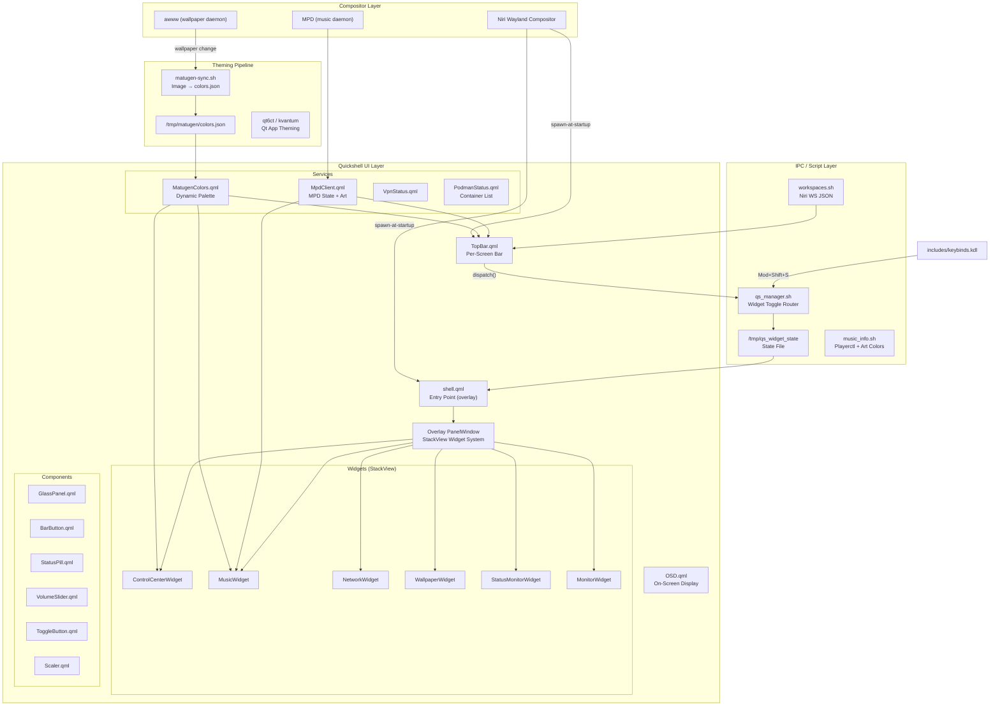

# NightForge Architecture

Two active subsystems:

1. **Harness Dashboard** (`harnessd`) — Go monitoring daemon on `127.0.0.1:9191`
2. **Desktop Shell** — Niri compositor + Quickshell UI + Matugen theming

The Go module is `github.com/ForeverLX/nightforge` (stdlib-only, `go 1.26.5`).

---

## 1. Harness Dashboard (`harnessd`)

### Overview

A single-binary monitoring dashboard: 5-minute health collection, layered
pipeline state (proposals/gates/failures/snapshots/tokens/cost), and a
single-file HTML frontend embedded via `//go:embed`. No DB, no npm, no
external deps. Runs as a systemd user service
(`~/.config/systemd/user/harnessd.service`, deployed outside the repo).

### Components

| Component | Purpose | Location |
|-----------|---------|----------|
| Entry point | Embed frontend, start collector, serve | `cmd/harnessd/main.go` |
| Router | API routes + static files + CORS/logging middleware | `internal/server/server.go` |
| Handlers | One per endpoint, JSON responses | `internal/handler/` |
| Collector | 5-min health ticker, JSONL persistence | `internal/collector/health.go` |
| Frontend | Single `index.html`, inline CSS/JS, Matugen-dark | `cmd/harnessd/frontend/` |

### API

| Endpoint | Handler | Source data |
|----------|---------|-------------|
| `GET /api/v1/health` | `health.go` | In-memory history + `data/history/*.jsonl` |
| `GET /api/v1/layers` | `layers.go` | Static 10-layer table + `data/{proposals,gates,failures}/*.json` |
| `GET /api/v1/sessions` | `sessions.go` | Pi/OMP/Hermes session directories |
| `GET /api/v1/snapshots` | `snapshots.go` | `data/snapshots/` |
| `GET /api/v1/routes` | `routes.go` | Static routing table (see below) |
| `GET /api/v1/cost` | `cost.go` | `data/tokens/current.json` (404 + hint until `token-tracker.sh` runs) |

### Data Flow

```
Collector (5-min ticker)
    │  reads /proc, /sys, nvidia-smi
    ▼
data/history/health-YYYY-MM-DD.jsonl   ← append-only snapshots
    ▲
    │  loaded at startup (loadHistory)
    │
handlers ── JSON ──▶ frontend (6 tabs, 30s health auto-refresh)
    ▲
scripts/harness/*.sh  (failure-miner, proposal-engine, gate-check,
    │                   snapshot-config/rollback, token-tracker,
    │                   pi-session-parser)
    ▼
data/{failures,gates,proposals,snapshots,tokens,cost}/
```

### Model Routing

The live routing table is served at `GET /api/v1/routes` from the static
slice in `internal/handler/routes.go` (currently 4 roles: Hermes BRAIN,
OMP EXECUTOR, Subagents, Pi/gnhf). It is the same table the L3/L8 layers
reference. Note: per current agent guidance in [AGENTS.md](AGENTS.md), Hermes
is deprecated and Pi is the planning role — the served table is a
reconciliation candidate, not something this doc changes.

### 10-Layer Harness

| Layer | Name | Status |
|-------|------|--------|
| L1 | Hardware/Infra | complete |
| L2 | Gateway/Cost | not-applicable (flat-rate) |
| L3 | Routing | complete |
| L4 | Failure Mining | complete |
| L5 | Proposal Engine | complete |
| L6 | Validation Gate | complete (5 rules) |
| L7 | Versioning & Rollback | complete |
| L8 | Routing Matrix | complete |
| L9 | Benefit Measurement | not-designed |
| L10 | Weight Update | not-designed |

---

## 2. Desktop Shell



### Stack

| Layer | Technology | Purpose |
|-------|-----------|---------|
| Compositor | Niri (Wayland) | Window management, tiling, keybinds |
| Shell / Bar | Quickshell (`shell.qml` + `TopBar.qml`) | Widget overlay + per-screen bar |
| Theming | Matugen | Dynamic color extraction from wallpaper |

`dotfiles/niri/.config/niri/config.kdl` autostart (the "replace DMS" block):
`awww-daemon`, `quickshell` overlay, `quickshell -p TopBar.qml`, matugen-sync,
`podman-restart.service`, `wallpaper-rotate.timer`, `mpd.service`.

### QML Source Layout

- **Canonical sources:** root `modules/` (incl. `Bar.qml`) and `services/` —
  imported by `dotfiles/quickshell/.config/quickshell/main.qml`
  (`import "../../../../services"`, `import "../../../../modules"`)
- **Deploy copies:** `dotfiles/quickshell/.config/quickshell/` — stowed to
  `~/.config/quickshell` by `scripts/apply-dotfiles.sh`; contains `shell.qml`,
  `TopBar-legacy.qml`, `main.qml`, `modules/`, `services/`, `components/`,
  `scripts/` (incl. `watchers/`)

### Services

| Service | Data | Updates |
|---------|------|---------|
| `MatugenColors.qml` | Palette from `/tmp/matugen/colors.json` | File watcher |
| `MpdClient.qml` | Track, artist, album, art URL, elapsed/total, play state | `mpc` polling + `idle` event |
| `VpnStatus.qml` | WireGuard `wg show` connected state | 5s poll |
| `PodmanStatus.qml` | Running container count + names/status | 5s poll |
| `SysData.qml` | CPU/RAM/disk/temp via `/proc` | 3s poll |

### IPC

File-based router: `qs_manager.sh` writes commands to `/tmp/qs_widget_state`;
`shell.qml` polls the file (with `inotifywait` fallback) and pushes widgets
onto the overlay `StackView` (morph transitions).

### Niri Config

```
dotfiles/niri/.config/niri/
├── config.kdl               # Entry point + autostart
└── includes/
    ├── compositor.kdl       # Animation, blur, opacity, gaps
    ├── input.kdl            # Keyboard, mouse, touch
    ├── keybinds.kdl         # Navigation, workspace, window ops
    ├── window-rules.kdl     # Floating windows, transparency rules
    ├── colors.kdl           # Auto-generated border colors
    └── local.kdl            # Machine-specific overrides (gitignored template)
```

### Theming Pipeline

```
Wallpaper change (awww) → matugen-sync.sh → /tmp/matugen/colors.json
    → MatugenColors.qml (file watcher) → all QML components re-render
```

Templates live in `dotfiles/matugen/.config/matugen/templates/` (Ghostty,
GTK/Qt, Neovim, btop, Mako, Rofi, Starship, Quickshell, Waybar).

---

## Dependencies

| Category | Packages |
|----------|----------|
| Compositor | `niri`, `awww` |
| Shell | `quickshell` (Qt6, QML) |
| Theming | `matugen`, `imagemagick`, `qt6ct` |
| Media | `mpd`, `mpc`, `playerctl` |
| Network | `networkmanager`, `wireguard-tools`, `bluetoothctl` |
| Audio | `pipewire`, `wireplumber`, `pamixer` |
| Containers | `podman` |
| Utils | `jq`, `inotify-tools`, `socat` |
| Dashboard | Go 1.26+ (stdlib only) |

---

## Known Issues

1. **Two QML source trees**: root `modules/`+`services/` and
   `dotfiles/quickshell/` copies have drifted (e.g. `modules/Bar.qml` differs
   from the dotfiles copy). Root is canonical per `main.qml` imports;
   reconciliation is a maintenance task, not a docs change.
2. **Workspace polling**: Niri lacks Hyprland's event socket; 500ms polling
   via `workspaces.sh`.
3. **Routing table drift**: `internal/handler/routes.go` still lists a
   "Hermes BRAIN" role; current guidance marks Hermes deprecated (see
   [AGENTS.md](AGENTS.md)).

## Design Decisions

See [docs/DECISIONS.md](docs/DECISIONS.md) for the full rationale
(Niri over Sway, Quickshell over eww/AGS, Matugen, Ghostty, Podman).
