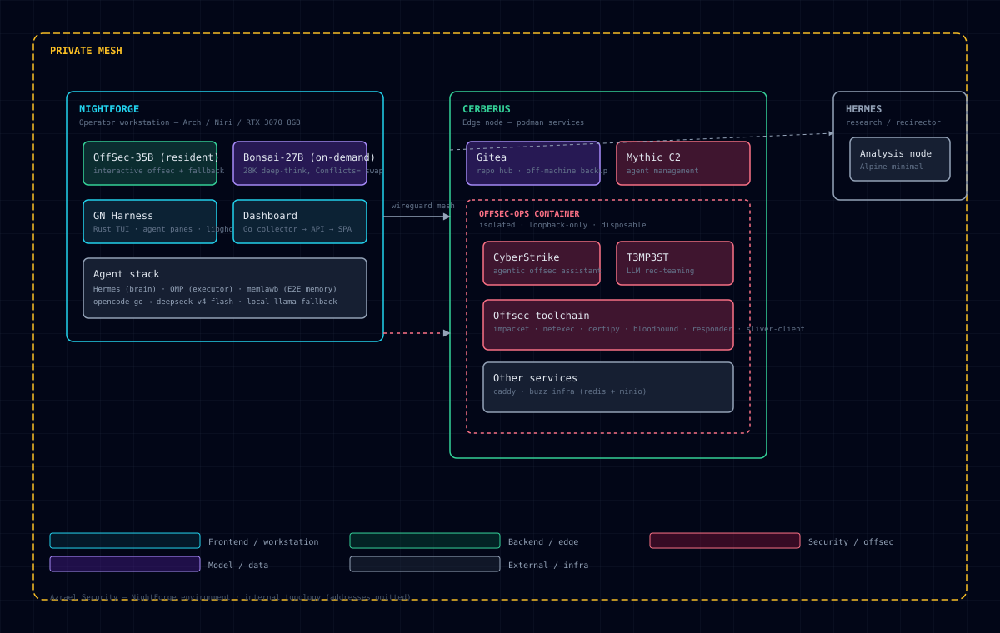

# NightForge

**A full environment for Red Team Operators, Security Researchers, and Agentic AI workflows.**

Built and operated by [CR1MS0N-Operator](https://github.com/CR1MS0N-Operator) | CR1MS0N-Operator

Part of the [Veil](https://github.com/CR1MS0N-Operator/veil) infrastructure project.

> NightForge is not a dotfile dump — it is a reproducible, production-grade environment that unifies three workloads on one Arch Linux machine: offensive security operations, security research, and agentic AI. The emphasis is on reproducibility, operational awareness, OPSEC-safe workflows, and long-term maintainability.



*Environment topology — node roles, model stack, and the isolated offsec toolchain. Internal addressing is deliberately omitted (see [SECURITY.md](SECURITY.md)).*

---

## 1. What NightForge Is

A single reproducible environment serving three audiences:

| Audience | What NightForge gives them |
|----------|---------------------------|
| **Red Team Operators** | Rootless containerized toolchain, engagement directory contract, recon pipeline, C2-aware dashboards, offsec LLM resident in VRAM |
| **Security Researchers** | Reproducible host manifests, container profiles for AD/web/RE work, benchmark + audit tooling, documented design decisions |
| **Agentic AI workflows** | Local model serving (offsec + deep-think), OMP/Hermes agent stack, session tracking, encrypted memory, self-improving harness |

Everything is version-controlled: host packages, container images, dotfiles, scripts, and the agent stack are all reproducible from this repo.

---

## 2. Environment Capabilities

### Compute & GPU

- **Hardware:** Intel i3-10105F · NVIDIA RTX 3070 8GB · Arch Linux (linux-zen) · Niri Wayland compositor
- Desktop (Niri/Quickshell) pins ~1.3GB VRAM → **~6.7GB free** for model inference
- Performance tuning under `system/optimizations/` (CPU governor, BBR, hugepages, NVMe udev rules)

### Local AI Models

Two llama.cpp servers on loopback; systemd `Conflicts=` ensures only one occupies VRAM at a time:

| Model | Quant | Service | Role | Throughput |
|-------|-------|---------|------|-----------|
| **CyberStrike-OffSec-35B** | Q3_K_M | `llama-server-offsec.service` | **Resident** — interactive offsec work + OMP fallback | 15–18 tok/s |
| **Bonsai-27B** | Q1_0 | `llama-server-bonsai.service` | **On-demand** — 28K-context deep-think only | — |

One model in VRAM at a time (swap via `Conflicts=`). Both expose the OpenAI-compatible API on `127.0.0.1`.

### Offsec Toolchain — `offsec-ops` Container (CERBERUS)

The offensive toolchain runs in a Podman container on the edge node (**CERBERUS**), not on the host:

- **cyberstrike v1.1.15** — interactive agentic offsec assistant
- **t3mp3st v1.0.0** — network/tempest tooling
- **impacket, netexec, certipy, bloodhound, responder, mitmproxy, pypykatz**
- **Suites:** Rubeus, SharpUp
- **sliver-client** (C2), **EyeWitness** (screenshot/reporting)
- Exposed **loopback-only** (no network exposure)

### Agentic AI Stack

- **OMP (lead/executor):** deepseek-v4-flash via opencode-go — **$10/mo flat**
- **Fallback chain:** opencode-go → local-llama (OffSec-35B)
- **Hermes:** long research, planning, kanban — deepseek-v4-flash
- **memlawb:** E2E-encrypted agent memory
- **Agent harness:** `harness/` (Rust TUI, ACP panes for omp/hermes/zero/pi/c4), 10-layer self-improving harness design in `harness/docs/10-layer-architecture.md`

### Infrastructure Roles

| Node | Role |
|------|------|
| **CERBERUS** | Edge node: Gitea (repo hub + vault backup), Mythic C2 stack, offsec-ops container |
| **NIGHTFORGE** | Operator workstation (this repo) |
| **HERMES** | Research/analysis node |

Nodes connect over a private WireGuard mesh. Internal addressing and the full
port registry are documented in the private ops vault, not this public README.

---

## 3. Quick Start

```bash
# 1. Clone the repository
git clone https://github.com/CR1MS0N-Operator/nightforge.git
cd nightforge

# 2. Review what will be installed
less manifests/host-packages.txt
less docs/INSTALL.md

# 3. Install system packages (review first!)
# See docs/INSTALL.md for full procedure
./install.sh --profile solo-operator --dry-run
./install.sh --profile solo-operator

# 4. Deploy dotfiles
./scripts/apply-dotfiles.sh

# 5. Build container profiles (optional, local work)
./modules/container/scripts/container.sh build-all

# 6. Validate the installation
./scripts/benchmark/system-baseline.sh

# 7. Initialize your first engagement
new-engagement my-client 10.10.10.0/24
```

---

## 4. Repository Layout

| Path | Purpose |
|------|---------|
| `modules/` | Capability modules: **niri** (compositor), **shell** (zsh/tmux + engagement layouts), **nightowl** (NightOwl tmux session), **container** (rootless Podman offsec profiles: toolbox/web/ad/re + `container.sh`) |
| `profiles/` | Deployment personas (`local-only`, `solo-operator`, `team-operator`) → manifest mapping, read by `install.sh` |
| `manifests/` | Package sets: host (explicit packages), AUR, container host stack, per-profile (ad/re/web/solo/team) |
| `scripts/` | Workflow library: **recon** (TBHM v4 + Euphrates pipeline, 4 modes), **security/audit**, **maintenance** (offsec-maintenance timer), **engagement**, **benchmark**, **setup**, helpers, Go backends (qs-watcher, niri-outputs) |
| `system/optimizations/` | Kernel/sysctl/udev/systemd performance tuning (cpu, network, memory, storage, boot) |
| `dotfiles/` | 27 stow packages: niri, quickshell, ghostty, matugen (17 color templates), zsh, tmux, nvim, operator-terminal, starship, mako, rofi, etc. |
| `internal/` + `dashboard-ctl/` + `web/` | Go dashboard: collector → API (`/api/v1` + SSE) → embedded web SPA; CLI for VMs/containers/services/C2/network |
| `services/` | Quickshell QML singletons: MatugenColors, MpdClient, VpnStatus, PodmanStatus |
| `session-tracker/` | Rust: OpenCode + Hermes session stats → quickshell agent-sessions widget |
| `harness/` | Rust TUI (`gn`): libghostty terminal with ACP agent panes (omp/hermes/zero/pi/c4) |
| `.claude/` | Claude Code project config: safety hooks (6 block scripts), deny-list, 13 commands. Legacy — see AGENTS.md |
| `docs/` | Design docs, audits, migration notes, snapshots |
| `10-Stack/` | 10-layer self-improving harness design + research |
| `install.sh` | Profile-driven installer (pacman manifests + directory contract) |

---

## Key Design Decisions

| Decision | Choice | Why |
|----------|--------|-----|
| Compositor | **Niri** (Wayland) | Scrolling layout, per-monitor workspaces, built-in overview. See `docs/NIRI-MIGRATION.md` |
| Shell widgets | **Quickshell** (QML) | GPU-accelerated Qt Quick, Matugen color sync, watcher-based (no polling loops) |
| Theming | **Matugen** | Material You HCT palette → 17 template targets, signal-aware reloads |
| Terminal | **Ghostty** | Multi-config dark/light switching, SIGUSR1 reload, GPU-accelerated |
| Containers | **Rootless Podman** | No daemon, minimal attack surface, `--userns=keep-id` |
| Offsec tooling | **Containerized offsec-ops on CERBERUS** | Toolchain off-host, loopback-only exposure |

Full rationale: `docs/DECISIONS.md`.

---

## Troubleshooting

See [docs/TROUBLESHOOTING.md](TROUBLESHOOTING.md) (Niri, Quickshell, containers, performance, network) and [docs/INSTALL.md](docs/INSTALL.md).

---

## Design Principles

1. **Reproducible by default.** Every config, package, and manifest is version-controlled; a fresh install reproduces the environment.
2. **Minimal attack surface.** Rootless containers, loopback-only service exposure, no unnecessary daemons.
3. **OPSEC-aware workflows.** Safety hooks gate destructive/credential/network commands; secrets never in the repo.
4. **Local-first.** Models run in-VRAM on the workstation; toolchain runs on the mesh, not third-party clouds.
5. **Maintainable over clever.** Boring tech (bash, KDL, QML); documented trade-offs (`docs/DECISIONS.md`).

---

## Changelog

See [CHANGELOG.md](CHANGELOG.md) for full history.

### 2026-08-01 — Full-Environment Refresh
- README rewritten to full-environment framing (Red Team Operators / Security Researchers / Agentic AI)
- Documented current stack: RTX 3070 8GB, CyberStrike-OffSec-35B + Bonsai-27B (dual llama-server, `Conflicts=` swap), offsec-ops container on CERBERUS, agentic stack (OMP/Hermes/memlawb)
- AGENTS.md model/provider/port sections updated to current reality

### v0.5.0 — Operator Terminal Framework + Niri Migration
- Operator terminal framework (VPN/engagement/git/network context), MITRE logging, engagement init, Sway → Niri migration, DMS bar, Starship

### v0.4.0 — Container Profile Architecture
- Rootless Podman profiles (toolbox/ad/re/web), package audit/cleanup, security hardening, performance baselines

---

## Disclaimer

All tooling is for authorized security research and engagement work only. Sensitive configurations and live operational details are intentionally excluded from this repository.

---

**Author:** Darrius Grate | CR1MS0N-Operator
**License:** MIT
**Last Updated:** 2026-08-01
